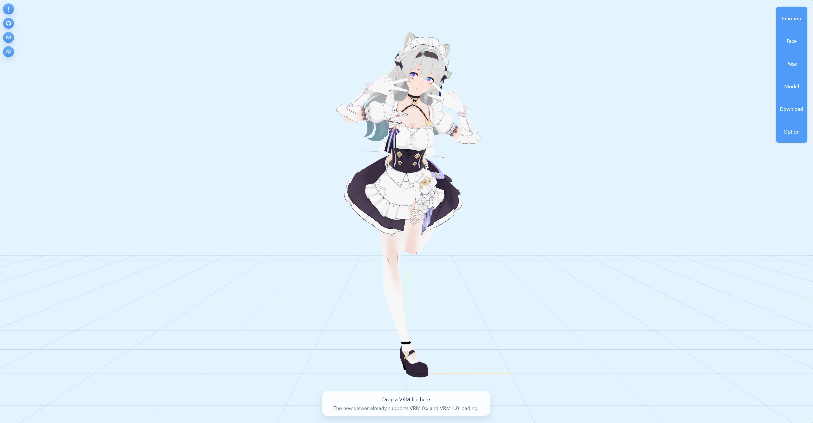

<h1 align="center">VRM Viewer</h1>

  <a href="#english">English</a> •
  <a href="#简体中文">简体中文</a>

---

------
<h2 id="english">English</h2>

A powerful, full-featured web-based 3D VRM model viewer with an integrated Node.js backend tailored for fetching and deobfuscating models directly from VRoid Hub.

This project combines an advanced standalone web viewer (supporting facial expressions, dynamic posing, and idle motions) with the decryption capabilities of [vrh-deobfuscator](https://github.com/uwu/vrh-deobfuscator). It allows you to paste a VRoid Hub character link directly into the browser panel, which then commands the local server to securely fetch, deobfuscate, and instantly display the model in the 3D scene.

> ⚠️ **Disclaimer:** This integration is provided for **educational and research purposes only.** Do not use downloaded models for unauthorized distribution or commercial use. Please respect the creators' licenses.

### ✨ Features

*   **VRM Support**: Loads VRM 0.x and the newest VRM 1.0 specifications (powered by `@pixiv/three-vrm`).
*   **Drag & Drop**: Easily drop local `.vrm` files into the web page to load models.
*   **Detailed Model Info**: Renders full metadata, licenses, permissions, and usage rules directly inside the viewer.
*   **Emotion & Face Controls**: Live manipulation of facial blendshapes (Joy, Angry, Sorrow, Fun, A/I/U/E/O, Blinking).
*   **Pose Editor**: Dynamically edit skeletal bones and save custom poses.
*   **Direct VRoid Hub Integration**: An Express server receives VRoid Hub links, manages async jobs, and seamlessly invokes `vrh-deobfuscator` to extract the clean `.glb` / `.vrm` format.

### 🚀 Setup & Installation

1.  **Prerequisites**: [Node.js](https://nodejs.org/) (v18+) and the [vrh-deobfuscator](https://github.com/uwu/vrh-deobfuscator) project downloaded.
2.  **Configure Backend**: You can override this path via an environment variable: `$env:DEOBFUSCATOR_DIR="YourPath/vrh-deobfuscator"`, or manually modify the `./vrh-deobfuscator` path.Ensure you run `pnpm install` inside the deobfuscator folder first.
3.  **Install Viewer Dependencies**: Run `npm install express cors` in this project's root.
4.  **Start Application**: Run `node main.js`.
5.  **Access Web Interface**: Open `http://127.0.0.1:8787` in your browser to import and start using your VRM model!

### 🙏Acknowledgments

- [**vrh-deobfuscator**](https://github.com/uwu/vrh-deobfuscator) — Provided the core logic for VRM model deobfuscation and downloading
- [**@pixiv/three-vrm**](https://github.com/pixiv/three-vrm) — Provided robust support for rendering native, fluid VRM 0.x / 1.0 models—along with rich visual effects—directly within web browsers
- [**Three.js**](https://threejs.org/) — Provided the powerful, low-level WebGL 3D rendering capabilities
- [**Express.js**](https://expressjs.com/) — Provided a lightweight yet efficient local Node-based proxy service
- [**fukalimi**](https://hub.vroid.com/en/characters/5891851072799936000/models/9192682752022965309) — The author of the default VRM displayed in the project
- [**神圣之光**](https://hub.vroid.com/en/users/20999653) - The author of the VRMA required for the project

---

<h2 id="简体中文">简体中文</h2>

一个强大、全量特性的基于 Web 的 3D VRM 模型查看器，集成了 Node.js 后端，专为从 VRoid Hub 直接下载并反混淆模型而设计。

本项目将高级的前端模型查看器（支持面部表情、动态骨骼编辑、待机动画等）与 [vrh-deobfuscator](https://github.com/uwu/vrh-deobfuscator) 的解密技术结合在了一起。你只需在浏览器面板直接粘贴 VRoid Hub 的角色链接，它就会命令本地服务器安全地下载、反混淆，并立刻将清理后的模型展示在你的 3D 场景中。

> ⚠️ **免责声明：** 此集成项目仅供**学习与研究交流使用**。请勿将下载的模型用于未经授权的分发或商业用途，并请始终尊重原作者的开源协议与版权约束。

### ✨ 核心特性

*   **全版本 VRM 支持**：支持 VRM 0.x 以及最新的 VRM 1.0 规范（基于 `@pixiv/three-vrm` 驱动）。
*   **拖拽极速加载**：直接将本地的 `.vrm` 文件拖入网页即可快速渲染模型。
*   **详尽的元数据面板**：直接在查看器内显示该模型的所有相关元数据、开源协议、权限以及使用规则。
*   **面部表情精细控制**：可实时操作面部混合变形（喜怒哀乐、A/I/U/E/O 发音口型、眨眼等）。
*   **动态姿势编辑器**：内置骨骼控制器，可针对全身进行精细化姿势调整并保存截图。
*   **VRoid Hub 直连下载系统**：Node/Express 后端通过异步队列处理 VRoid 链接，无缝调用 `vrh-deobfuscator` 子进程来解密 AES 密钥及清理顶点混淆，并直接输出干净标准的 `.vrm` 模型。

### 🚀 安装与启动指引

1.  **环境准备**：需要安装 [Node.js](https://nodejs.org/) (建议 v18+) 以及下载 [vrh-deobfuscator](https://github.com/uwu/vrh-deobfuscator) 项目。
2.  **配置后端路径**：默认情况下后端会去 `./vrh-deobfuscator` 寻找脚本。你可以通过环境变量覆盖此路径：`$env:DEOBFUSCATOR_DIR="你的路径/vrh-deobfuscator"`，或者手动修改`./vrh-deobfuscator`路径。同时别忘了在 deobfuscator 目录里执行 `pnpm install` 安装好解密组件的依赖。
3.  **安装查看器依赖**：在当前项目（VRM Viewer）根目录运行 `npm install express cors`。
4.  **启动后端服务**：运行命令 `node main.js`。
5.  **访问 Web 界面**：在浏览器打开 `http://127.0.0.1:8787`，即可导入VRM模型使用啦！

### 🙏 致谢

- [**vrh-deobfuscator**](https://github.com/uwu/vrh-deobfuscator) — 提供了关键的 VRM 模型反混淆与下载核心逻辑
- [**@pixiv/three-vrm**](https://github.com/pixiv/three-vrm) — 为网页浏览器中呈现原生、流畅的 VRM 0.x / 1.0 模型及丰富特效提供了强大支持
- [**Three.js**](https://threejs.org/) — 提供底层且强大的 WebGL 3D 渲染表现
- [**Express.js**](https://expressjs.com/) — 提供轻量级而高效的本地 Node 接口代理服务
- [**fukalimi**](https://hub.vroid.com/en/characters/5891851072799936000/models/9192682752022965309) - 项目默认展示的VRM的作者
- [**神圣之光**](https://hub.vroid.com/en/users/20999653) - 项目所需VRMA的作者
