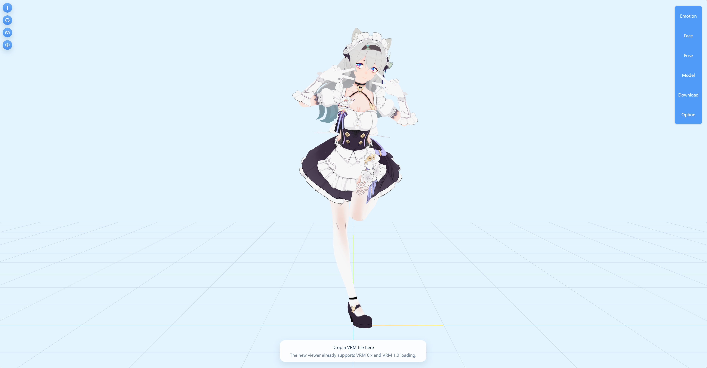

<h1 align="center">VRM Viewer Pro</h1>

<p align="center">
  A modern Web-based VRM viewer with VRoid Hub download & deobfuscation support.<br>
  支持 VRM 0.x / 1.0、表情控制、姿势编辑、VRMA 动作与 VRoid Hub 下载的一体化 Web VRM 查看器。
</p>

<p align="center">
  
  
  
  
  
</p>
<p align="center">
  <a href="#english">English</a> •
  <a href="#简体中文">简体中文</a>
</p>
---



---


## 🧭 Contents / 目录

**English:**
[About](#en-about) · [Features](#en-features) · [Project Structure](#en-structure) · [Quick Start](#en-quick-start) · [VRoid Hub Download](#en-download) · [Viewer Controls](#en-viewer) · [Backend](#en-backend) · [Deployment](#en-deployment)

**简体中文：**
[项目简介](#zh-about) · [核心特性](#zh-features) · [项目结构](#zh-structure) · [快速开始](#zh-quick-start) · [VRoid Hub 下载](#zh-download) · [查看器](#zh-viewer) · [后端](#zh-backend) · [部署](#zh-deployment)

---

<h2 id="english">English</h2>

<a id="en-about"></a>
## ✨ About

**VRM Viewer Pro** is a browser-based 3D VRM viewer with a standalone Node.js backend for downloading and deobfuscating VRoid Hub preview models.

The project has evolved from a simple viewer into a **frontend / backend separated application**:

- The **frontend** focuses on VRM rendering and interaction: expressions, face controls, pose editing, VRMA motions, model metadata, screenshots, local files, and downloaded model preview.
- The **backend** handles VRoid Hub fetching, deobfuscation, asynchronous jobs, queue control, output retention, cache cleanup, CORS, and optional protected sessions.

> [!WARNING]
> **For educational and research purposes only.** Respect the original creator's copyright, terms of use, attribution requirements, and restrictions on redistribution, modification, commercial use, etc. Do not use downloaded models for infringing, illegal, or harmful purposes.

<a id="en-features"></a>
## 🌟 Features

| Category | Highlights |
| --- | --- |
| 🧍 **VRM Viewer** | VRM 0.x and VRM 1.0 loading powered by `@pixiv/three-vrm` |
| 📂 **Local Model Loading** | File picker and drag & drop for local `.vrm` files |
| ℹ️ **Model Metadata** | Title, author, VRM version, permissions, redistribution/modification rules, license and related URLs |
| 😊 **Expression Controls** | Joy, Angry, Sorrow, Fun and other supported expressions |
| 👀 **Face Controls** | Look-at-camera, auto blink, manual blink and A / I / U / E / O mouth shapes |
| 🦴 **Pose Editor** | Bone editing, model movement, built-in poses and custom pose saving |
| 🎬 **VRMA Motion System** | Bundled appearing / waiting / liked motions with idle-motion support |
| 💗 **Model Interaction** | Double-click / double-tap the model to trigger an interaction animation and heart effect |
| 📷 **Screenshot** | Capture the current rendered scene directly from the viewer |
| 🖥️ **Viewer Options** | Toggle idle motion, grid, XYZ axis, reset camera, or hide the interface for a clean view |
| 🌐 **UI Localization** | Automatically follows browser language for English, Simplified Chinese and Japanese |
| ⬇️ **VRoid Hub Download** | Paste a `hub.vroid.com` model/character link and let the backend process it asynchronously |
| 🍪 **Frontend Cookie Override** | Optional VRoid Hub Cookie in the Download panel; a non-empty frontend Cookie overrides the backend default |
| 💾 **Optional Cookie Persistence** | Cookie is temporary by default; it is written to `localStorage` only after clicking **Save Cookie** |
| ⚙️ **Backend Job System** | Queue/concurrency limits, job polling, output retention, cache cleanup and CLI mode |
| 🔐 **Protected Deployment Mode** | Optional CORS allowlist + HttpOnly session Cookie for frontend/backend deployments |

<a id="en-structure"></a>
## 🧩 Project Structure

```text
VRM-Viewer-Pro/
├─ frontend/
│  ├─ index.html                 # Web viewer entry
│  ├─ assets/
│  │  ├─ app.js                  # Main viewer logic
│  │  ├─ styles.css              # UI styles
│  │  └─ *.vrma                  # Bundled VRMA motions
│  ├─ models/
│  │  └─ Firefly.vrm             # Default/sample model
│  └─ preview.png
│
├─ backend/
│  ├─ index.js                   # CLI + HTTP backend
│  ├─ package.json
│  ├─ src/                       # Deobfuscation/runtime modules
│  ├─ cache/                     # Runtime cache (generated automatically)
│  └─ output/                    # Processed VRM files (generated automatically)
│
└─ 前后端使用说明.md
```

> The bundled VRM / VRMA assets are regular project resources. If you remove them from a custom package, keep the corresponding code paths or replace the files with your own assets.

<a id="en-quick-start"></a>
## 🚀 Quick Start

### Requirements

- [Node.js](https://nodejs.org/) **18 or newer**
- [pnpm](https://pnpm.io/) for backend dependencies
- A modern browser with WebGL and ES module support
- A small static HTTP server for the frontend

> [!TIP]
> If the repository provides packaged builds, you can download them directly from **[GitHub Releases](../../releases/latest)** instead of setting up from source.

### 1. Install backend dependencies

```bash
cd backend
pnpm install
```

### 2. Start the backend

```bash
pnpm start
```

Equivalent command:

```bash
node index.js --server
```

The backend listens on port `8787` by default.

### 3. Start the frontend

From the project root, for example with Python:

```bash
python -m http.server 8080 -d frontend
```

Then open:

```text
http://127.0.0.1:8080/?backend=http://127.0.0.1:8787
```

> [!TIP]
> Do not open `frontend/index.html` directly with `file://`. Serving the frontend over HTTP avoids module loading, CORS and asset-loading problems.

## 🔗 How the Frontend Finds the Backend

The frontend resolves the backend in this order:

1. `window.__VRM_DOWNLOAD_BACKEND_BASE__`
2. URL query parameter `?backend=...`
3. Current page origin
4. Fallback: `http://127.0.0.1:8787`

For a simple local setup, using the `?backend=` parameter is the easiest option.

<a id="en-download"></a>
## ⬇️ VRoid Hub Download Workflow

1. Open the **Download** panel.
2. Paste a `hub.vroid.com` character/model URL.
3. Optionally enter a VRoid Hub Cookie.
4. Accept the download notice.
5. The frontend sends a job request to the backend.
6. The backend fetches and deobfuscates the model.
7. The frontend polls the asynchronous job until the model is ready.
8. Preview the generated VRM directly or download the file.

### Cookie Priority

```text
Non-empty Cookie in the frontend
          ↓ higher priority
Backend COMMON_HEADERS.Cookie
          ↓
No Cookie
```

The Cookie entered in the frontend is used only for VRoid Hub requests associated with that task.

### Save Cookie / Clear Saved

- Typing a Cookie and downloading **does not save it automatically**.
- Clicking **Save Cookie** stores the normalized Cookie in browser `localStorage`.
- The saved Cookie is restored on the next visit.
- Clicking **Clear saved** removes the stored Cookie and clears the input.
- The frontend Cookie itself is not exposed through the backend job-status response.

> [!CAUTION]
> `localStorage` is readable by JavaScript running under the same origin. Only save a Cookie on a frontend you trust. For a shared or public computer, use the Cookie temporarily and do not click **Save Cookie**.

> [!NOTE]
> The **VRoid Hub Cookie** above is different from the backend's protected-mode **session Cookie** (`vrm_session`). The first is used by the backend when accessing `hub.vroid.com`; the second is an HttpOnly authorization Cookie issued by your own backend.

<a id="en-viewer"></a>
## 🧍 Viewer Controls

### Model

- Select a local VRM file.
- Drag and drop a `.vrm` file onto the stage.
- Load the bundled default model.
- Orbit / zoom the camera around the model.

### Emotion & Face

- Adjust supported emotion expressions in real time.
- Control blink and mouth-shape expressions.
- Toggle automatic blinking.
- Toggle camera-following eye/look-at behavior.

### Pose

Built-in pose presets currently include:

- T-Stance
- A-Stance
- Model Stand
- Double Peace

You can also create custom poses, edit humanoid bones, move the model, name the pose and save it in browser storage.

### Motion & Interaction

When the corresponding bundled `.vrma` files are available, the viewer can use:

- **Appearing** motion when presenting a model
- **Waiting** motion as the preferred idle animation
- **Liked** interaction motion

Double-click on desktop or double-tap on touch devices to trigger the liked interaction.

<a id="en-backend"></a>
## 🛠️ Backend Usage

The backend supports both **CLI mode** and **HTTP server mode**.

### One-off CLI download

```bash
cd backend
node index.js "https://hub.vroid.com/en/characters/.../models/..."
```

A model ID can also be passed directly:

```bash
node index.js 5015639279121294719
```

Processed files are written to `backend/output/`.

### Common server options

```bash
node index.js --server \
  --host 127.0.0.1 \
  --port 8787 \
  --max-concurrent 2 \
  --max-queue-size 20
```

Useful options include:

| Option | Purpose |
| --- | --- |
| `--host <host>` | Listening address |
| `--port <port>` | Listening port |
| `--max-concurrent <count>` | Maximum concurrent model-processing jobs |
| `--max-queue-size <count>` | Maximum waiting jobs |
| `--download-retention-ms <ms>` | Retention time after a successful download |
| `--unclaimed-output-retention-ms <ms>` | Retention time before an output is first downloaded |
| `--job-retention-ms <ms>` | Job metadata retention |
| `--cache-retention-ms <ms>` | Backend cache retention |
| `--cleanup-interval-ms <ms>` | Automatic cleanup interval |
| `--keep-forever` | Keep generated output permanently |
| `--delete-after-download` | Remove generated output after download |
| `--debug-artifacts` | Write debugging artifacts |

For the complete parameter and environment-variable list, see the documents included with the project:

- `前后端使用说明.md`
- `backend/index.js 参数说明.md`

<a id="en-deployment"></a>
## 🔐 Deployment Modes

### Local / Public Mode

Default-style local deployment can use:

```bash
node index.js --server --host 127.0.0.1 --port 8787
```

This is intended for local use. Avoid exposing an unrestricted backend directly to the public Internet.

### Protected Mode

Set a specific allowed frontend origin and a strong session secret:

```powershell
$env:CORS_ORIGIN = "http://127.0.0.1:8080"
$env:SESSION_JWT_SECRET = "replace-with-a-long-random-secret"
node index.js --server --host 127.0.0.1 --port 8787
```

Protected mode uses an HttpOnly session Cookie and restricts job/model access to the current frontend session.

For a cross-site HTTPS deployment, configure `CORS_ORIGIN`, `PUBLIC_BASE_URL`, `SESSION_COOKIE_SAME_SITE` and `SESSION_COOKIE_SECURE` according to your deployment topology.

## ⚠️ Notes

- VRoid Hub behavior may change over time, so the download/deobfuscation flow can require maintenance after upstream changes.
- The frontend currently loads core Three.js / three-vrm modules through CDN import maps; an Internet connection is therefore required unless you replace those imports with local copies.
- VRM features vary by model. Some models may not expose every expression, look-at function, metadata field or humanoid bone expected by the UI.
- Treat browser-persisted VRoid Hub Cookies as sensitive data.

## 🙏 Acknowledgments

- [**vrh-deobfuscator**](https://github.com/uwu/vrh-deobfuscator) — Inspiration and core work related to VRoid Hub model deobfuscation
- [**@pixiv/three-vrm**](https://github.com/pixiv/three-vrm) — VRM 0.x / 1.0 loading and runtime support
- [**@pixiv/three-vrm-animation**](https://github.com/pixiv/three-vrm) — VRM Animation / VRMA integration
- [**Three.js**](https://threejs.org/) — WebGL 3D rendering foundation
- [**glTF Transform**](https://gltf-transform.dev/) — glTF processing utilities used by the backend
- [**fukalimi**](https://hub.vroid.com/en/characters/5891851072799936000/models/9192682752022965309) — Author of the original default VRM referenced by the project

---

<h2 id="简体中文">简体中文</h2>

<a id="zh-about"></a>
## ✨ 项目简介

**VRM Viewer Pro** 是一个基于浏览器的 3D VRM 模型查看器，并配套独立的 Node.js 后端，用于处理 VRoid Hub 预览模型的下载与反混淆。

相比旧版，目前项目已经重构为清晰的**前后端分离架构**：

- **前端**专注于 VRM 展示与交互：表情、面部控制、姿势编辑、VRMA 动作、模型元数据、拍照、本地模型以及下载后即时预览。
- **后端**负责 VRoid Hub 请求、模型反混淆、异步任务、队列与并发控制、产物保留、缓存清理、CORS 以及可选的受保护会话模式。

> [!WARNING]
> **本项目仅供学习、研究与技术交流使用。** 请务必遵守模型原作者的版权、使用条款、署名要求，以及对再分发、修改、商业用途等方面的限制。请勿将下载的模型用于侵权、违法或有害用途。

<a id="zh-features"></a>
## 🌟 核心特性

| 分类 | 功能 |
| --- | --- |
| 🧍 **VRM 查看器** | 基于 `@pixiv/three-vrm`，支持 VRM 0.x 与 VRM 1.0 |
| 📂 **本地模型加载** | 支持文件选择以及直接拖拽 `.vrm` 到页面 |
| ℹ️ **模型信息** | 展示标题、作者、VRM 格式、使用权限、再分发/修改规则、许可证及相关链接 |
| 😊 **情绪表情** | 实时控制开心、生气、悲伤、愉快等模型支持的表情 |
| 👀 **面部控制** | 视线跟随镜头、自动眨眼、手动眨眼以及 A / I / U / E / O 口型 |
| 🦴 **姿势编辑器** | 支持骨骼编辑、移动模型、内置姿势与自定义姿势保存 |
| 🎬 **VRMA 动作系统** | 支持入场、待机、Liked 交互等内置 VRMA 动作 |
| 💗 **模型互动** | PC 双击 / 移动端双击模型可触发互动动作与爱心效果 |
| 📷 **拍照** | 可直接保存当前 3D 场景截图 |
| 🖥️ **显示选项** | 待机动作、网格、XYZ 坐标轴、重置镜头以及一键隐藏界面 |
| 🌐 **多语言界面** | 根据浏览器语言自动适配简体中文、English、日本語 |
| ⬇️ **VRoid Hub 下载** | 粘贴 `hub.vroid.com` 角色/模型链接，由后端异步处理并返回 VRM |
| 🍪 **前端 Cookie 覆盖** | “下载”面板可填写 VRoid Hub Cookie；非空前端 Cookie 优先于后端默认值 |
| 💾 **可选 Cookie 保存** | 默认仅临时使用；只有点击 **保存 Cookie** 后才写入 `localStorage` |
| ⚙️ **后端任务系统** | 支持并发限制、任务队列、轮询、产物保留、缓存清理和 CLI 模式 |
| 🔐 **受保护部署** | 可配置 CORS 白名单与 HttpOnly 会话 Cookie，适合前后端独立部署 |

<a id="zh-structure"></a>
## 🧩 项目结构

```text
VRM-Viewer-Pro/
├─ frontend/
│  ├─ index.html                 # 前端入口
│  ├─ assets/
│  │  ├─ app.js                  # 查看器核心逻辑
│  │  ├─ styles.css              # 界面样式
│  │  └─ *.vrma                  # 内置 VRMA 动作
│  ├─ models/
│  │  └─ Firefly.vrm             # 默认 / 示例模型
│  └─ preview.png
│
├─ backend/
│  ├─ index.js                   # CLI + HTTP 后端入口
│  ├─ package.json
│  ├─ src/                       # 反混淆及运行模块
│  ├─ cache/                     # 运行时缓存（自动生成）
│  └─ output/                    # 处理后的 VRM（自动生成）
│
└─ 前后端使用说明.md
```

> 内置 VRM / VRMA 只是项目资源。如果你为了缩小发布包临时移除这些文件，无需删除相关代码引用；重新放回原路径或替换成自己的资源即可。

<a id="zh-quick-start"></a>
## 🚀 快速开始

### 环境要求

- [Node.js](https://nodejs.org/) **18 或更高版本**
- [pnpm](https://pnpm.io/)（用于安装后端依赖）
- 支持 WebGL 与 ES Module 的现代浏览器
- 一个用于托管前端静态文件的 HTTP 服务

> [!TIP]
> 如果仓库提供已经打包好的版本，也可以直接前往 **[GitHub Releases](../../releases/latest)** 下载，无需从源码开始配置。

### 1. 安装后端依赖

```bash
cd backend
pnpm install
```

### 2. 启动后端

```bash
pnpm start
```

等价于：

```bash
node index.js --server
```

后端默认监听 `8787` 端口。

### 3. 启动前端

在项目根目录执行，例如使用 Python：

```bash
python -m http.server 8080 -d frontend
```

浏览器访问：

```text
http://127.0.0.1:8080/?backend=http://127.0.0.1:8787
```

> [!TIP]
> 不建议直接双击 `frontend/index.html` 使用 `file://` 打开。通过 HTTP 服务访问可以避免 ES Module、跨域以及资源加载方面的问题。

## 🔗 前端如何寻找后端

当前前端会按照以下顺序确定下载后端地址：

1. `window.__VRM_DOWNLOAD_BACKEND_BASE__`
2. 地址栏参数 `?backend=...`
3. 当前网页同源地址
4. 回退到 `http://127.0.0.1:8787`

对于本地使用，最简单的方式就是直接通过 `?backend=` 指定。

<a id="zh-download"></a>
## ⬇️ VRoid Hub 下载流程

1. 打开底部菜单中的 **下载**。
2. 粘贴 `hub.vroid.com` 的角色或模型页面链接。
3. 根据需要填写 VRoid Hub Cookie。
4. 阅读并同意下载提示。
5. 前端向后端提交异步任务。
6. 后端获取模型并完成反混淆处理。
7. 前端自动轮询任务状态。
8. 处理完成后可直接**预览**或**下载 VRM**。

### Cookie 优先级

```text
前端输入框中的非空 Cookie
          ↓ 优先级更高
后端 COMMON_HEADERS.Cookie
          ↓
不使用 Cookie
```

前端传入的 Cookie 仅作为当前任务访问 VRoid Hub 时的 Cookie 覆盖值。

### 保存 Cookie / 清除已保存

- 只输入 Cookie 并执行下载，**不会自动保存**。
- 主动点击 **保存 Cookie** 后，才会将规范化后的 Cookie 写入浏览器 `localStorage`。
- 下次打开页面时会自动恢复此前保存的 Cookie。
- 点击 **清除已保存** 会删除浏览器中保存的值，并同时清空输入框。
- 前端 Cookie 本身不会通过后端任务状态接口返回给页面。

> [!CAUTION]
> `localStorage` 中的数据可以被同源网页里的 JavaScript 读取。因此只建议在你信任的前端页面中保存 Cookie；如果使用公共电脑或不希望持久化，请只临时填写，不要点击 **保存 Cookie**。

> [!NOTE]
> 这里的 **VRoid Hub Cookie** 与后端受保护模式下签发的 **`vrm_session` 会话 Cookie** 是两种完全不同的 Cookie：前者用于后端访问 `hub.vroid.com`，后者是你自己的后端用于会话鉴权的 HttpOnly Cookie。

<a id="zh-viewer"></a>
## 🧍 查看器使用说明

### 模型

- 选择本地 VRM 文件。
- 将 `.vrm` 文件直接拖入页面。
- 加载项目内置默认模型。
- 使用鼠标 / 触控操作镜头旋转与缩放。

### 情绪与面部

- 实时调整模型支持的情绪表情。
- 控制眨眼与口型。
- 开启 / 关闭自动眨眼。
- 开启 / 关闭视线跟随镜头。

### 姿势

当前内置姿势包括：

- T 姿势
- A 姿势
- 模特站姿
- 双手比耶

同时支持创建**自定义姿势**：可以编辑 Humanoid 骨骼、移动模型、填写姿势名称并保存到浏览器存储中。

### 动作与互动

当对应 `.vrma` 文件存在时，查看器可使用：

- **Appearing**：模型入场动作
- **Waiting**：优先使用的待机动作
- **Liked**：模型互动动作

PC 端双击模型、触屏设备连续双击模型，即可触发 Liked 互动动画与爱心效果。

<a id="zh-backend"></a>
## 🛠️ 后端使用

后端同时支持**单次 CLI 下载**与**常驻 HTTP 服务**。

### 单次 CLI 下载

```bash
cd backend
node index.js "https://hub.vroid.com/en/characters/.../models/..."
```

也可以直接传入模型 ID：

```bash
node index.js 5015639279121294719
```

处理后的文件会输出到 `backend/output/`。

### 常用服务参数

```bash
node index.js --server \
  --host 127.0.0.1 \
  --port 8787 \
  --max-concurrent 2 \
  --max-queue-size 20
```

常用选项：

| 参数 | 说明 |
| --- | --- |
| `--host <host>` | 服务监听地址 |
| `--port <port>` | 服务监听端口 |
| `--max-concurrent <count>` | 最大并发处理任务数 |
| `--max-queue-size <count>` | 最大排队任务数 |
| `--download-retention-ms <ms>` | 成功下载后的产物保留时间 |
| `--unclaimed-output-retention-ms <ms>` | 尚未被下载的产物保留时间 |
| `--job-retention-ms <ms>` | 任务元数据保留时间 |
| `--cache-retention-ms <ms>` | 后端缓存保留时间 |
| `--cleanup-interval-ms <ms>` | 自动清理周期 |
| `--keep-forever` | 永久保留生成产物 |
| `--delete-after-download` | 下载后删除生成产物 |
| `--debug-artifacts` | 输出调试产物 |

完整参数和环境变量请查看项目内附文档：

- `前后端使用说明.md`
- `backend/index.js 参数说明.md`

<a id="zh-deployment"></a>
## 🔐 部署模式

### 本地 / 公开模式

仅本机使用时，可以直接：

```bash
node index.js --server --host 127.0.0.1 --port 8787
```

这种模式适合本地使用，不建议将无限制的后端直接暴露到公网。

### 受保护模式

为前端设置明确的允许来源，并配置足够强的会话密钥：

```powershell
$env:CORS_ORIGIN = "http://127.0.0.1:8080"
$env:SESSION_JWT_SECRET = "请替换为足够长的随机密钥"
node index.js --server --host 127.0.0.1 --port 8787
```

受保护模式会使用 HttpOnly 会话 Cookie，并限制当前会话只能访问属于自己的模型与任务。

如果前后端使用不同的 HTTPS 域名，还需要根据实际部署情况正确配置 `CORS_ORIGIN`、`PUBLIC_BASE_URL`、`SESSION_COOKIE_SAME_SITE` 与 `SESSION_COOKIE_SECURE`。

## ⚠️ 使用提示

- VRoid Hub 的页面与接口实现可能发生变化，上游改动后下载/反混淆逻辑可能需要同步维护。
- 当前前端通过 CDN Import Map 加载 Three.js / three-vrm 等核心模块；除非自行替换为本地依赖，否则首次使用需要能够访问对应 CDN。
- 不同 VRM 模型提供的 Expression、LookAt、Humanoid 骨骼与 Metadata 能力并不完全相同，因此部分控制项可能会因模型而不可用。
- 保存在浏览器中的 VRoid Hub Cookie 应视为敏感数据，请谨慎使用持久化功能。

## 🙏 致谢

- [**vrh-deobfuscator**](https://github.com/uwu/vrh-deobfuscator) — 为 VRoid Hub 模型反混淆相关实现提供了重要思路与基础工作
- [**@pixiv/three-vrm**](https://github.com/pixiv/three-vrm) — 提供 VRM 0.x / 1.0 加载与运行时支持
- [**@pixiv/three-vrm-animation**](https://github.com/pixiv/three-vrm) — 提供 VRM Animation / VRMA 支持
- [**Three.js**](https://threejs.org/) — 提供 WebGL 3D 渲染基础
- [**glTF Transform**](https://gltf-transform.dev/) — 提供后端使用的 glTF 处理能力
- [**fukalimi**](https://hub.vroid.com/en/characters/5891851072799936000/models/9192682752022965309) — 项目原默认 VRM 模型的作者

---

<p align="center">
  Made for VRM viewing, posing, interaction and research workflows.
</p>
